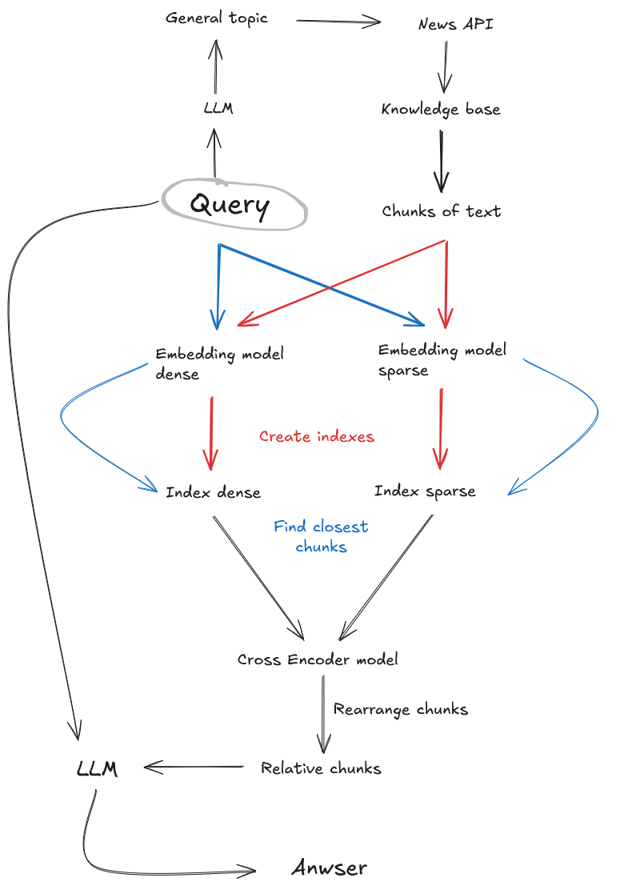

# RAG Event Forecasting System

A sophisticated event forecasting system based on Retrieval-Augmented Generation (RAG) architecture that combines information retrieval from external sources with generative language models to produce well-founded predictions.

## Overview

This system processes natural language queries about future events, automatically extracts relevant information from various external sources, and generates probability estimates with detailed justifications. The modular architecture supports dynamic knowledge base updates and can adapt to different domains effectively.

## Architecture

The system implements three main architectural variants:

- **PlainLLM**: Baseline language model using only parametric knowledge
- **NaiveRAG**: Classic RAG implementation with sequential search and generation
- **HybridRAG**: Advanced architecture combining multiple search strategies with cross-encoder reranking



### Core Components

1. **Knowledge Base Formation**
   - Dynamic extraction via The Guardian API
   - Pre-processed PROPHET dataset integration
   
2. **Vectorization & Indexing**
   - Dense vectorization using Sentence-BERT
   - Sparse vectorization with TF-IDF
   - FAISS-based efficient similarity search
   
3. **Search & Ranking**
   - Hybrid search across multiple indices
   - Cross-encoder reranking for improved relevance
   
4. **Answer Generation**
   - Context-aware probability estimation
   - Structured JSON response with justification

## Technology Stack

### Core Libraries
- **LangChain**: RAG pipeline framework
- **Groq**: Language model inference
- **Sentence-Transformers**: Semantic embeddings
- **FAISS**: High-performance vector search
- **scikit-learn**: TF-IDF vectorization

### Data Processing
- **pandas**: Structured data handling
- **numpy**: Numerical computations
- **aiohttp**: Async HTTP requests
- **BeautifulSoup4**: HTML parsing

### Models & APIs
- **Llama-3.1-8b-instant**: Primary generative model
- **all-MiniLM-L6-v2**: Dense vector embeddings
- **ms-marco-MiniLM-L-6-v2**: Cross-encoder reranking
- **The Guardian API**: Real-time news data
- **PROPHET Dataset**: Curated forecasting benchmark

## Performance Results

Experimental evaluation on the PROPHET dataset demonstrates significant improvements over baseline approaches:

### Classification Metrics (ROC-AUC)
- **PlainLLM**: 0.49
- **NaiveRAG (Guardian)**: 0.62
- **NaiveRAG (Local Corpus)**: 0.63
- **HybridRAG (Guardian)**: 0.62
- **HybridRAG (Local Corpus)**: **0.66**
- **Community Predictions**: 0.82

### Regression Metrics (MSE)
- **PlainLLM**: 0.108
- **HybridRAG (Local Corpus)**: **0.097** (9.8% improvement)

## Installation

```bash
# Clone the repository
git clone https://github.com/yourusername/rag-event-forecasting.git
cd rag-event-forecasting

# Create virtual environment
python -m venv venv
source venv/bin/activate  # On Windows: venv\Scripts\activate

# Install dependencies
pip install -r requirements.txt

# Edit .env with your API keys
```

## Configuration

Create a `.env` file with the following variables:

```env
GROQ_API_KEY=your_groq_api_key
GUARDIAN_API_KEY=your_guardian_api_key
```

## Usage

### Basic Example

```python
from app.rag_pipelines import AsyncBinaryQuestionPlainLLM, AsyncBinaryQuestionNaiveRAG, AsyncBinaryQuestionRAG_hybrid_crossencoder, AsyncBinaryQuestionRAG_hybrid_crossencoder_CoT
import pandas as pd
import time


df_1 = pd.read_json('./PROPHET/data_2024-8/dataset_L1.json')
query = df_1.iloc[0]['question']
articles = df_1.iloc[0]['articles']
print(f"Query: {query}")
print("Running Async Hybrid RAG with Cross-Encoder")

async_rag_pipeline = AsyncBinaryQuestionRAG_hybrid_crossencoder()
start_time = time.time()
response = asyncio.run(async_rag_pipeline.run(query, data=articles))
end_time = time.time()
print(f"Response: {response}")
print(f"Time taken: {end_time - start_time:.2f} seconds")

```

## Evaluation Metrics

The system supports comprehensive evaluation across multiple dimensions:

- **Regression**: MSE, RMSE, MAE
- **Classification**: ROC-AUC, Precision, Recall, F1, Accuracy
- **Weighted Metrics**: Account for prediction confidence/consensus
- **Temporal Validation**: Strict date filtering to prevent data leakage


## Limitations & Future Work

### Current Limitations
- Tendency to overestimate event probabilities (high recall, moderate precision)
- Significant gap compared to human expert predictions
- Dependency on source quality affects performance

### Future Improvements
- Enhanced probability calibration methods
- Multi-agent collaborative forecasting
- Real-time knowledge base updates
- Integration with structured knowledge graphs

## Research Background

This implementation is based on the research conducted at Saint Petersburg State University, exploring RAG architectures for event forecasting. The work builds upon:

- **Lewis et al. (2020)**: Foundational RAG architecture
- **Gao et al. (2023)**: Comprehensive RAG survey
- **Chang et al. (2024)**: LLM temporal event forecasting
- **Tao et al. (2025)**: PROPHET benchmark and CIL methodology


## Author

**Stepan Olizko** - Saint Petersburg State University
- Scientific Supervisor: Anton Y. Pershin, Ph.D.

## Acknowledgments

- Saint Petersburg State University
- PROPHET dataset creators
- The Guardian API
- Open source community for the foundational libraries


